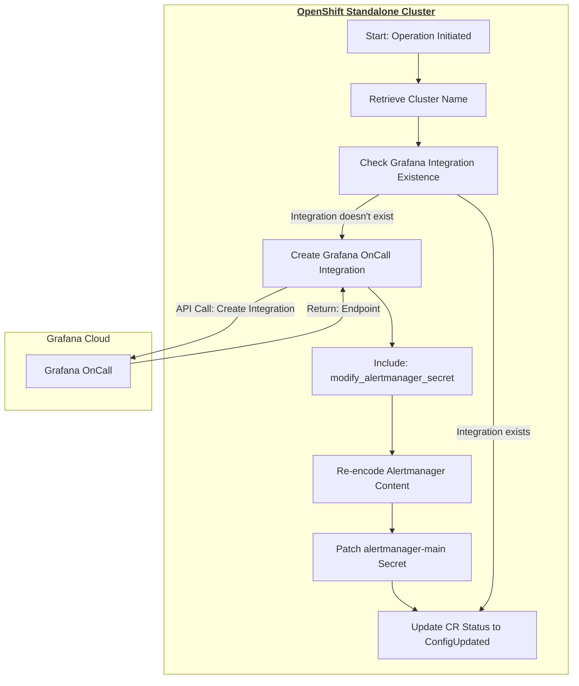

# Grafana Cloud Operator

## Project Overview
The Grafana Cloud Operator is an Ansible-based OpenShift Operator that automates the configuration and management of Grafana OnCall within an OpenShift cluster. This operator simplifies the process of setting up Grafana OnCall, ensuring seamless integration with AlertManager and consistent alert forwarding.


### What is Grafana Cloud?
Grafana Cloud is a fully managed observability platform from Grafana Labs, providing a seamless experience across metrics, logs, and traces. Within Grafana Cloud, Grafana OnCall is a dedicated incident response coordination system, directly integrating with Grafana's alerting mechanism to manage on-call schedules, escalations, and incident tracking.


### How the Operator Works

#### Operator SDK Framework - Ansible
This operator is built using the Ansible Operator Framework built on Operator SDK, combining the ease of use of Operators with the power of Ansible automation. It reacts to custom resources created within the OpenShift cluster to manage the creation and integration of Grafana OnCall resources with the OpenShift Cluster.

#### Grafana OnCall Integration Process
The Grafana Cloud Operator leverages the flexibility of Ansible in responding to custom resource changes on the cluster, ensuring Grafana OnCall is properly configured and maintained. 

#### Workflow 
The operator's workflow can be described in two different architectural models:

**A. Hub and Spoke Model**  

In the Hub-Spoke model, the operator is installed on a central Hub cluster and manages Grafana OnCall configurations for multiple Spoke clusters. This model is ideal for organizations with multiple clusters and aims to centralize monitoring and management.

```mermaid
graph TD

    subgraph "Hub and Spoke Integration with Grafana OnCall"
        subgraph "OpenShift Hub Cluster"
            InitHub[Start: Operation Initiated in Hub]
            GetGCOHub[Get All GrafanaCloudOperator CRs]
            CheckMultipleCRs[Ensure Only One GCO CR Exists]
            GetToken[Retrieve Grafana API Token from Secret]
            ListIntegrations[Fetch List of Existing Integrations in Grafana OnCall]
            FetchClusters[Fetch ClusterDeployments from All Namespaces]
            DetermineMissingIntegrations[Determine Clusters Missing Integrations]
            CreateIntegration[Create Integration in Grafana OnCall for Missing Clusters]
            
            InitHub --> GetGCOHub
            GetGCOHub --> CheckMultipleCRs
            CheckMultipleCRs --> GetToken
            GetToken --> ListIntegrations
            ListIntegrations --> FetchClusters
            FetchClusters --> DetermineMissingIntegrations
            DetermineMissingIntegrations --> CreateIntegration
            CreateIntegration --> Syncset
        end

        subgraph "Grafana Cloud"
            GOHub[Grafana OnCall]
        end

        subgraph "Spoke Clusters"
            SC1[Spoke Cluster 1]
            SC2[Spoke Cluster 2]
            SC3[Spoke Cluster 3]
        end

        CreateIntegration -->|Request: Create Integration| GOHub
        GOHub -->|Return: Endpoint| CreateIntegration
        Syncset --> |Hive Operator| SC1
        Syncset --> |Hive Operator| SC2
        Syncset --> |Hive Operator| SC3
    end

```



  
*Centralized ClusterDeployments Monitoring:*
The operator, installed on the Hub cluster, continually monitors for the presence of ClusterDeployment resources from Hive that are registered from Spoke clusters.
These resources are significant markers, indicating the clusters that require Grafana On Call integration.  

*Cross-Cluster Grafana On Call Setup:*
For each ClusterDeployment identified, the operator communicates with the Grafana Cloud's API, initiating the integration process.
This setup involves creating necessary configurations on Grafana Cloud and retrieving vital details such as the AlertManager HTTP URL for each respective Spoke cluster.  

*Syncset Synchronization:*
Utilizing Syncset resources from Hive, the operator ensures that alerting configurations are consistent across all Spoke clusters.
This mechanism efficiently propagates configuration changes from the Hub to the Spokes, particularly for alert forwarding settings in AlertManager.  

*Centralized Secret Management:*
The operator centrally manages the alertmanager-main-generated secret for each Spoke cluster.
Through the Syncset, it disseminates the updated secret configurations, ensuring each Spoke cluster's AlertManager can successfully forward alerts to Grafana On Call.

**B. Standalone Cluster Model**  

In a standalone cluster model, the operator is installed directly on a single cluster and manages the Grafana OnCall configuration solely for that cluster. This setup is suitable for individual clusters or standalone environments.



*Operator Workflow in Standalone Cluster:*
The operator functions within the single OpenShift cluster, monitoring  resources that indicate the local cluster's need for Grafana On Call integration.  

*Direct Grafana On Call Setup:*
Upon identifying the GCO CR, described in the next section, the operator proceeds with the Grafana OnCall setup by interacting with Grafana Cloud's API.
It establishes the necessary integrations and secures essential details, including the AlertManager HTTP URL.  

*In-Cluster Configuration Management:*
The operator directly applies configuration changes within the cluster, bypassing the need for Syncsets.
It ensures the AlertManager's alert forwarding settings are correctly configured for seamless communication with Grafana On Call.  

*Local Secret Management:*
Managing the alertmanager-main-generated secret locally, the operator updates its configurations.
This update enables the AlertManager within the standalone cluster to route alerts effectively to Grafana On Call, completing the integration process.


### Prerequisites
- An OpenShift cluster up and running.
- Access to Grafana OnCall's API key with relevant permissions.
- A secret in the grafana-cloud-operator namespace with the Grafana OnCall API Token. Here's an example:

```bash
kubectl -n grafana-cloud-operator create secret generic grafana-api-token-secret --from-literal=api-token=342fgcb835a62959234534asdhtwsdfwdf0d2b9e83cf8a2fa8987ae7c0336bb46
```
*Note: You can use the same command to create your secret. Make sure you replace the above API Token from your Grafana OnCall settings page.*

### Installation

#### Install using custom catalog

#### Install using helm charts

### Quick Start
After installation, you can create a GrafanaCloudOperator resource by applying the below CRD that the operator recognizes.

The operator gets its instructions from a custom resource (CR) that follows the GrafanaCloudOperator Custom Resource Definition (CRD). This CR contains all the necessary information, from the API token required to interact with Grafana Cloud to the mode of operation the operator should adopt.

Here's a step-by-step guide on understanding and applying this configuration:

1. Preparing Your Custom Resource:

First, let's break down the essential parts of the CR:

```
apiVersion: grafanacloud.stakater.com/v1alpha1
kind: GrafanaCloudOperator
metadata:
  name: grafanacloudoperator-sample  # This is a user-defined name for your custom resource
  namespace: grafana-cloud-operator  # Namespace where the operator is installed
spec:
  enabled: true
  grafanaAPIToken:
    key: api-token  # The key field within the secret holding the Grafana OnCall API token
    secretName: grafana-api-token-secret  # The name of the Kubernetes secret storing the Grafana OnCall API token
  provisionMode: hubAndSpoke  # Determines the mode of operation - 'hubAndSpoke' or 'standaloneCluster'
```

metadata: Contains general information about the custom resource that you are creating, such as its name and the namespace it resides in.  
spec: This is where the bulk of the configuration goes. It's broken down further below:  
enabled: Currently does nothing. But the idea is to use the flag to support removal of Grafana Integration in the future.  
grafanaAPIToken: Since the operator needs to interact with Grafana OnCall's API, you need to provide it with an API token. This token is stored within a Kubernetes secret for security, and here you point the operator to the right secret and key.  
provisionMode: Indicates how the operator should function. It could be in a 'hubAndSpoke' mode where it manages multiple clusters or 'standaloneCluster' for managing a single cluster.  

2. Applying the Custom Resource:

Once your custom resource is ready and tailored for your specific use case, you need to apply it within your OpenShift environment. This action tells the operator what it should do.

```bash
oc apply -f your-config-file.yaml
```

3. Modes of Operation:

The provisionMode in the spec can be one of the following two values:

hubAndSpoke: Use this when you have the operator installed on a central Hub cluster, and you intend for it to manage Grafana OnCall integrations on multiple Spoke clusters.  
standaloneCluster: This is used when the operator is handling Grafana OnCall integration for a single cluster, where it's installed and operated.

Here's how you would set the provisionMode for a standalone cluster:
```
spec:
  provisionMode: standaloneCluster
```

The operator adapts its behavior based on this directive, ensuring that your Grafana On Call integrations are set up and managed in a way that's optimal for your organizational architecture and needs.
